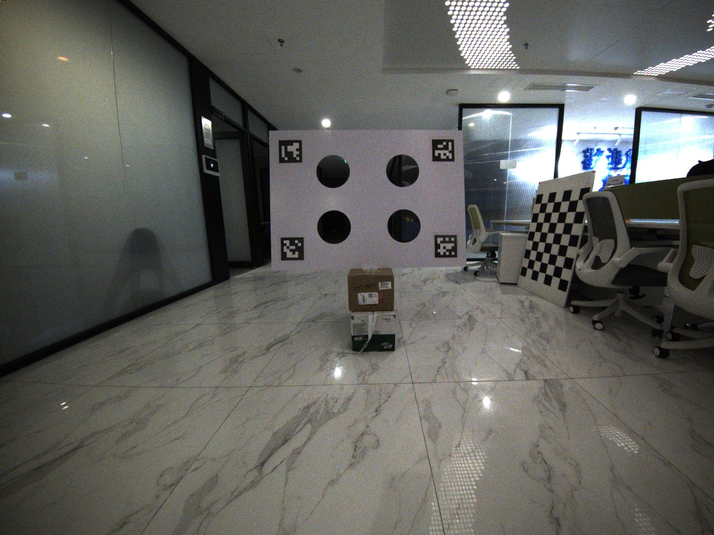
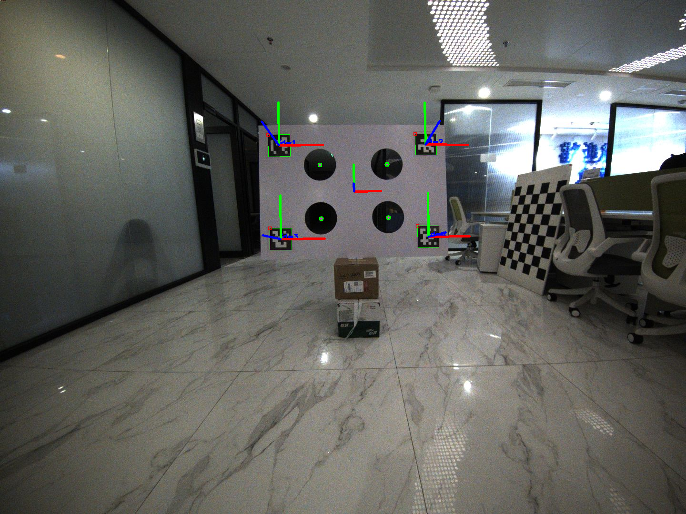

# fast_calib_core

A ROS-agnostic, header-only C++ library for camera-LiDAR extrinsic calibration.

## Overview

`fast_calib_core` provides the core algorithms for the [FAST-Calib](https://github.com/hku-mars/FAST-Calib) project, decoupled from ROS dependencies. This allows the calibration functionality to be used in any C++ project, including ROS1, ROS2, or standalone applications.

## Features

- **Header-only library**: No compilation required, just include the headers
- **ROS-agnostic**: Works with any C++ project
- **Single-scene calibration**: Fast calibration from a single observation
- **Multi-scene joint optimization**: Weighted SVD-based calibration from multiple observations for improved accuracy
- **Multiple LiDAR types**: Supports both mechanical (Velodyne-style) and solid-state LiDARs (Livox)
- **ArUco-based target**: Uses ArUco markers for robust detection
- **SVD-based calibration**: Robust singular value decomposition for transformation estimation
- **Visualization utilities**: Project point clouds to images with color

## Dependencies

- [PCL](https://pointclouds.org/) >= 1.10 (Point Cloud Library)
- [OpenCV](https://opencv.org/) >= 4.0 with ArUco module
- [Eigen3](https://eigen.tuxfamily.org/)
- C++17 compatible compiler

## Installation

### As a Git Submodule

```bash
# In your project directory
git submodule add https://github.com/windzu/fast_calib_core.git external/fast_calib_core
```

Then in your `CMakeLists.txt`:

```cmake
add_subdirectory(external/fast_calib_core)
target_link_libraries(your_target PRIVATE fast_calib_core::fast_calib_core)
```

### Standalone Build

```bash
mkdir build && cd build
cmake .. -DFAST_CALIB_CORE_BUILD_EXAMPLES=ON
make -j$(nproc)
```

### System Installation

```bash
mkdir build && cd build
cmake ..
make -j$(nproc)
sudo make install
```

Then use `find_package`:

```cmake
find_package(fast_calib_core REQUIRED)
target_link_libraries(your_target PRIVATE fast_calib_core::fast_calib_core)
```

## Tutorial: Camera-LiDAR Calibration

This tutorial demonstrates how to perform camera-LiDAR extrinsic calibration using the `calibrate_from_files` example program.

### Test Data

Download the sample dataset from Google Drive:

- **[Sample Dataset (Mid360 + Camera)](https://drive.google.com/file/d/15-ABjE6SKx4eZdFdzsdIFKC2Y_tXT-jv/view?usp=sharing)**

The dataset contains:

- `11.pcd` - Livox Mid360 point cloud (3,634,009 points)
- `11.png` - Camera image (1440x1080)
- `intrinsics.yaml` - Camera intrinsic parameters

### Build the Example

```bash
cd fast_calib_core
mkdir build && cd build
cmake .. -DFAST_CALIB_CORE_BUILD_EXAMPLES=ON
make -j$(nproc)
```

### Run Calibration

```bash
# Create output directory
mkdir -p output

# Run calibration (solid-state LiDAR mode for Mid360)
./examples/calibrate_from_files \
    ../data/mid360/11.pcd \
    ../data/mid360/11.png \
    ../data/mid360/intrinsics.yaml \
    --lidar-type solid \
    --output ./output
```

### Command Line Options

```
Usage: calibrate_from_files <pcd_file> <image_file> <camera_yaml> [options]

Arguments:
  pcd_file     Path to LiDAR point cloud (.pcd)
  image_file   Path to camera image (.png, .jpg)
  camera_yaml  Path to camera intrinsics file

Options:
  --lidar-type <type>  LiDAR type: 'solid' (default) or 'mech'
                       solid: Solid-state LiDAR (e.g., Livox Mid360)
                       mech:  Mechanical LiDAR (e.g., Velodyne, Ouster)
  --output <dir>       Output directory for results (default: .)
```

### Expected Output

```
FAST-Calib Core Library v0.1.0
==========================================
LiDAR type: Solid-state

Loaded camera intrinsics:
  fx=522.124, fy=522.275
  cx=773.466, cy=534.053
  k1=0.0032495, k2=-0.0171041

Loaded XYZ point cloud (solid-state mode): 3634009 points
Loaded image: 1440x1080

Detecting circles in LiDAR point cloud...
[INFO]  [LiDARDetector] Starting solid-state LiDAR detection...
[INFO]  [LiDARDetector] Filtered cloud size: 1313027
[INFO]  [LiDARDetector] After voxel filter: 477382
[INFO]  [LiDARDetector] Plane cloud size: 121449
[INFO]  [LiDARDetector] Extracted 7271 edge points.
[INFO]  [LiDARDetector] Number of edge clusters: 6
  Found 4 circle centers
Detecting ArUco markers in image...
[INFO]  [QRDetector] Detected 4 markers
  Found 4 circle centers

Computing extrinsic calibration...
[INFO]  [Calibration] Calibration RMSE: 0.002005 m

Calibration successful!
RMSE: 0.002005 m

Transformation matrix (T_camera_lidar):
  [    0.046103,     0.997654,    -0.050602,    -0.222727]
  [   -0.009401,    -0.050220,    -0.998694,    -0.027279]
  [   -0.998893,     0.046519,     0.007064,     3.757941]
  [    0.000000,     0.000000,     0.000000,     1.000000]

Creating colored point cloud...
  Colored 1710778 points

Saving results to ./output/
  Results saved successfully

Done!
```

### Output Files

| File | Description |
|------|-------------|
| `single_calib_result.txt` | Calibration result in FAST-LIVO2 format |
| `transformation.txt` | 4x4 transformation matrix |
| `annotated_image.png` | Image with ArUco detection visualization |
| `colored_cloud.pcd` | Point cloud colored by camera texture |

### Result File Format

The `single_calib_result.txt` follows FAST-LIVO2 format:

```yaml
# FAST-Calib result
cam_model: Pinhole
cam_width: 1440
cam_height: 1080
scale: 1.0
cam_fx: 522.124
cam_fy: 522.275
cam_cx: 773.466
cam_cy: 534.053
cam_d0: 0.0032495    # k1 (radial distortion)
cam_d1: -0.0171041   # k2 (radial distortion)
cam_d2: 0.000669657  # p1 (tangential distortion)
cam_d3: -0.000350205 # p2 (tangential distortion)

Rcl: [ 0.046103273,  0.997654080, -0.050601516,
      -0.009400862, -0.050219826, -0.998693764,
      -0.998892546,  0.046518769,  0.007063511]
Pcl: [-0.222726792, -0.027279139,  3.757940531]

RMSE: 0.002004615 m
```

### Visual Results

**Input Image:**



**ArUco Detection Result:**



### Camera Intrinsics Format

The camera intrinsics YAML file should contain:

```yaml
# Camera intrinsics
image_width: 1440
image_height: 1080

# Focal length and principal point
fx: 522.124   # or cam_fx
fy: 522.275   # or cam_fy
cx: 773.466   # or cam_cx
cy: 534.053   # or cam_cy

# Distortion coefficients (OpenCV model)
k1: 0.0032495    # or cam_d0
k2: -0.0171041   # or cam_d1
p1: 0.000669657  # or cam_d2
p2: -0.000350205 # or cam_d3
```

### Distortion Parameter Mapping

| FAST-Calib | OpenCV | Description |
|------------|--------|-------------|
| cam_d0 | k1 | 1st radial distortion |
| cam_d1 | k2 | 2nd radial distortion |
| cam_d2 | p1 | 1st tangential distortion |
| cam_d3 | p2 | 2nd tangential distortion |

---

## Configuration File Interface

For users who prefer a simpler interface, the `calibrate` tool accepts a single YAML configuration file that specifies all calibration parameters and scenes.

### Single-Scene Calibration

Create a `config.yaml` file:

```yaml
# Camera intrinsics
camera:
  image_width: 1440
  image_height: 1080
  distortion_coefficients:
    k1: 0.00324949759262203
    k2: -0.0171040538369167
    p1: 0.000669657443377146
    p2: -0.000350205468789575
  intrinsics:
    fx: 522.123514287681
    fy: 522.275153384482
    cx: 773.466430504725
    cy: 534.053165700174

# LiDAR configuration
lidar:
  type: "solid"  # "solid" for Livox, "mech" for mechanical LiDAR

# Calibration target parameters
target:
  marker_size: 0.20
  delta_width_qr_center: 0.55
  delta_height_qr_center: 0.35
  circle_radius: 0.12

# Single scene (relative paths from config file location)
scenes:
  - name: "scene_01"
    image: "11.png"
    pointcloud: "11.pcd"
    filter:
      min: [1.0, -3.0, -2.0]
      max: [5.0, 3.0, 3.0]

# Output configuration
output:
  path: "output"
```

Run calibration:

```bash
./build/examples/calibrate data/mid360/config.yaml
```

### Multi-Scene Joint Calibration

For improved accuracy, configure multiple scenes:

```yaml
scenes:
  - name: "scene_11"
    image: "11.png"
    pointcloud: "11.pcd"
    filter:
      min: [1.0, -3.0, -2.0]
      max: [5.0, 3.0, 3.0]

  - name: "scene_22"
    image: "22.png"
    pointcloud: "22.pcd"
    filter:
      min: [1.0, -3.0, -2.0]
      max: [5.0, 3.0, 3.0]

  - name: "scene_33"
    image: "33.png"
    pointcloud: "33.pcd"
    filter:
      min: [1.0, -3.0, -2.0]
      max: [5.0, 3.0, 3.0]
```

The tool automatically detects multi-scene configuration and performs joint optimization using all scenes.

### Configuration Reference

| Section | Field | Description |
|---------|-------|-------------|
| `camera` | `intrinsics` | fx, fy, cx, cy focal length and principal point |
| `camera` | `distortion_coefficients` | k1, k2, p1, p2 distortion |
| `lidar` | `type` | "solid" (Livox) or "mech" (Velodyne/Ouster) |
| `target` | `marker_size` | ArUco marker side length (meters) |
| `target` | `delta_width_qr_center` | Horizontal distance between QR centers |
| `target` | `delta_height_qr_center` | Vertical distance between QR centers |
| `target` | `circle_radius` | Circle hole radius |
| `scenes[].filter.min` | [x,y,z] | ROI minimum bounds |
| `scenes[].filter.max` | [x,y,z] | ROI maximum bounds |
| `output` | `path` | Output directory (relative or absolute) |

---

## Quick Start (Programmatic API)

```cpp
#include <fast_calib_core.hpp>

using namespace fast_calib;

int main() {
    // Setup camera intrinsics
    CameraIntrinsics camera;
    camera.fx = 500.0;
    camera.fy = 500.0;
    camera.cx = 320.0;
    camera.cy = 240.0;

    // Setup calibration parameters
    CalibParams params;
    params.camera = camera;
    params.target.marker_edge_size = 0.05;   // 5cm ArUco markers
    params.target.marker_distance = 0.30;    // 30cm between marker centers
    params.target.circle_diameter = 0.20;    // 20cm circles
    params.lidar_type = LiDARType::SolidState;

    // Load your data
    PointCloudRingPtr cloud = loadPointCloud("scan.pcd");
    cv::Mat image = cv::imread("image.png");

    // Detect circles in LiDAR
    LiDARDetector lidar_detector;
    auto lidar_result = lidar_detector.detect(cloud, params);

    // Detect markers and compute circle centers from camera
    QRDetector qr_detector(camera);
    auto qr_result = qr_detector.detect(image, params.target);

    // Compute calibration
    CalibrationCalculator calculator;
    auto result = calculator.compute(lidar_result.centers, qr_result.centers);

    if (result.success) {
        std::cout << "Calibration RMSE: " << result.rmse << " m" << std::endl;
        // Use result.transformation (4x4 matrix)
    }

    return 0;
}
```

## API Reference

### Core Types

- `CameraIntrinsics`: Camera intrinsic parameters (fx, fy, cx, cy, distortion)
- `TargetParams`: Calibration target parameters (marker size, distances)
- `CalibParams`: Complete calibration parameters
- `CalibrationResult`: Result containing transformation matrix and RMSE
- `LiDARType`: Enum for LiDAR type (Mechanical, SolidState)
- `PointXYZRing`: Custom PCL point type with ring information

### Detectors

#### LiDARDetector

```cpp
LiDARDetector detector(logger);  // Optional custom logger
LiDARDetectionResult result = detector.detect(cloud, params);
```

#### QRDetector

```cpp
QRDetector detector(camera_intrinsics);
QRDetectionResult result = detector.detect(image, target_params);
```

### Calibration

#### CalibrationCalculator

**Single-scene calibration:**

```cpp
CalibrationCalculator calc(logger);  // Optional custom logger
CalibrationResult result = calc.compute(lidar_centers, camera_centers);
```

**Multi-scene joint optimization:**

```cpp
#include <fast_calib_core.hpp>

using namespace fast_calib;

// Collect scene data from multiple observations
std::vector<SceneData> scenes;
scenes.emplace_back(lidar_centers_1, camera_centers_1);
scenes.emplace_back(lidar_centers_2, camera_centers_2);
scenes.emplace_back(lidar_centers_3, camera_centers_3);

// Perform joint optimization
CalibrationCalculator calc;
CalibrationResult result = calc.computeMultiScene(scenes);

// With custom weights (optional)
std::vector<double> weights = {2.0, 1.0, 1.0};  // Higher weight for scene 1
result = calc.computeMultiScene(scenes, &weights);

// With pre-sorted point correspondences (skip internal sorting)
result = calc.computeMultiScene(scenes, nullptr, false);

if (result.success) {
    std::cout << "Multi-scene RMSE: " << result.rmse << " m" << std::endl;
    // Use result.transformation (4x4 matrix)
}
```

**SceneData structure:**

```cpp
struct SceneData {
  PointCloudXYZPtr lidar_centers;  // Circle centers in LiDAR frame (4 points)
  PointCloudXYZPtr qr_centers;     // Circle centers in camera frame (4 points)
  
  bool isValid() const;  // Returns true if both have exactly 4 points
};
```

### Utilities

#### Point Cloud Projection

```cpp
PointCloudXYZRGBPtr colored;
projectPointCloudToImage(cloud, transformation, K, D, image, colored);
```

#### Result Saving

```cpp
ResultSaver saver("/output/path");
saver.saveCalibrationResults(params, result, colored_cloud, annotated_image);
```

## Custom Logging

The library uses dependency injection for logging. Provide your own callback:

```cpp
void myLogger(fast_calib::LogLevel level, const std::string& msg) {
    // Your logging implementation
    std::cout << msg << std::endl;
}

LiDARDetector detector(myLogger);
```

## Calibration Target

The library expects a calibration target with:

- 4 ArUco markers arranged in a square
- 4 circular cutouts centered at the marker positions
- Default ArUco dictionary: DICT_6X6_250

Adjustable parameters:

- `marker_edge_size`: Size of ArUco markers (default: 0.05m)
- `marker_distance`: Distance between marker centers (default: 0.30m)
- `circle_diameter`: Diameter of circular cutouts (default: 0.20m)

## ROS Integration

This library is designed to be wrapped by ROS-specific packages:

- **ROS1**: See [FAST-Calib](https://github.com/hku-mars/FAST-Calib)
- **ROS2**: See [FAST-Calib-ROS2](https://github.com/windzu/FAST-Calib-ROS2)

## Syncing with Upstream

This library tracks the upstream FAST-Calib project. See [CHANGELOG.md](CHANGELOG.md) for:

- Which upstream commits have been incorporated
- File mapping between projects
- Guidelines for porting fixes

## License

This project is subject to the same license as the original FAST-Calib project.
See [LICENSE](LICENSE) for details.

## Citation

If you use this library in academic work, please cite the original FAST-Calib paper:

```bibtex
@article{zheng2024fast,
  title={FAST-Calib: Fast and Accurate Extrinsic Calibration for LiDAR-Camera Systems},
  author={Zheng, Chunran and others},
  journal={...},
  year={2024}
}
```

## Acknowledgments

- Original FAST-Calib authors at HKU MARS Lab
- PCL, OpenCV, and Eigen communities
